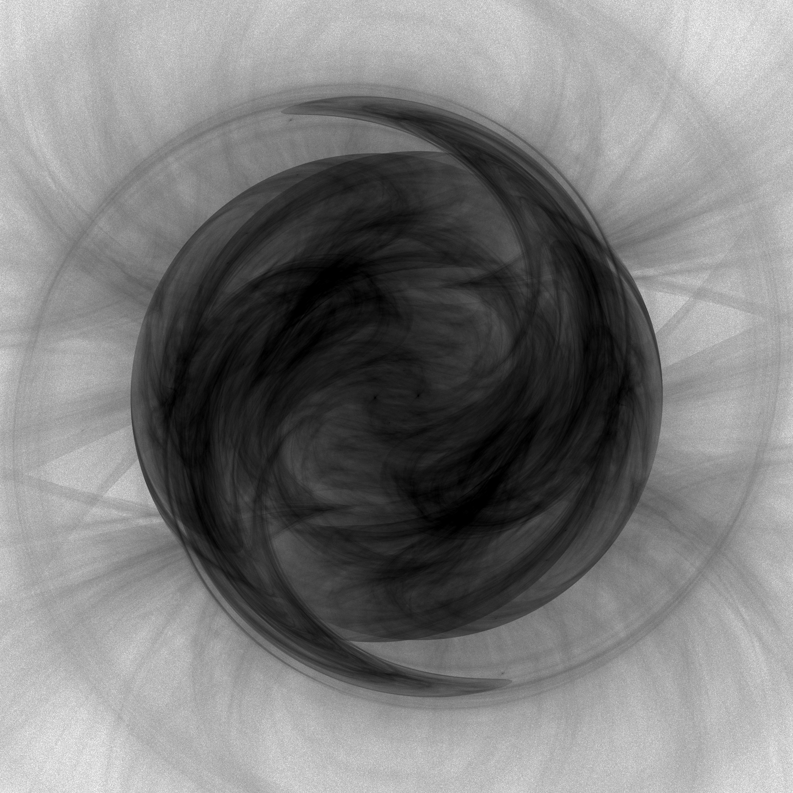
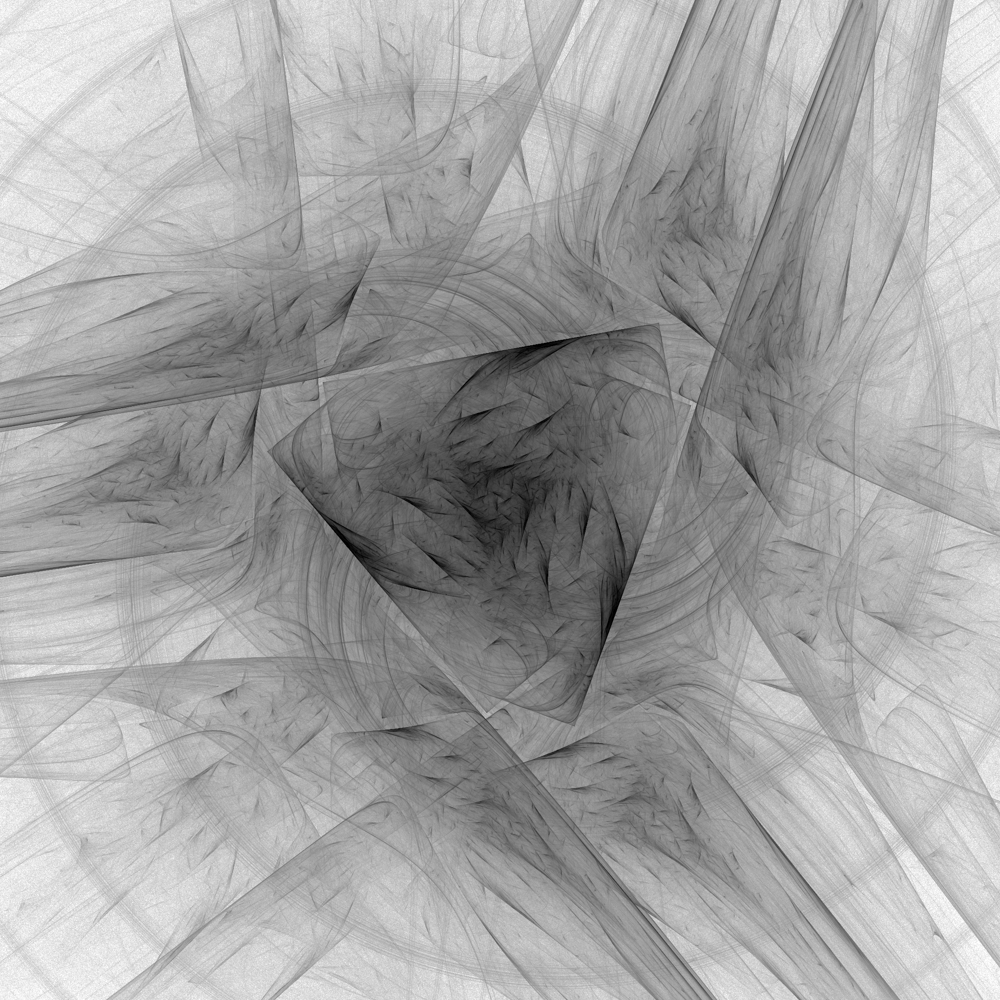
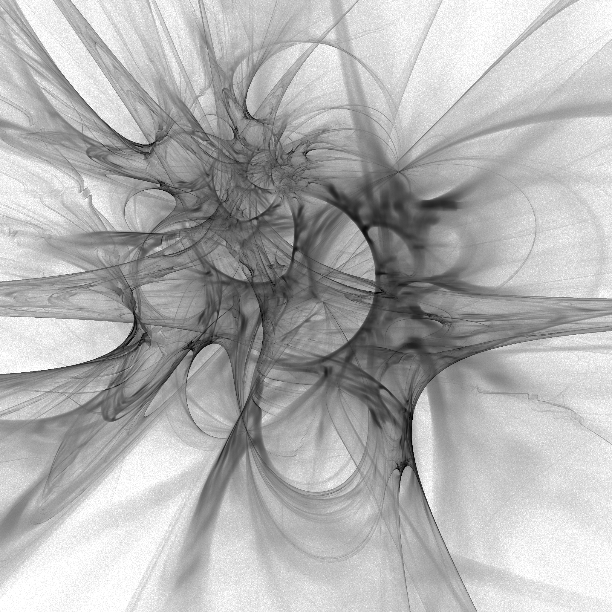
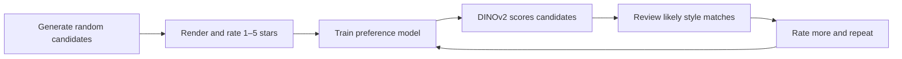

# Native Fractal-Flame Curator

Native Fractal-Flame Curator is a Windows desktop tool for reducing the labor
of fractal discovery. It generates reproducible random Apophysis-compatible
flames and renders them locally, because you cannot know whether a set of
parameters produces a good image until you see the result.

You explore a broad range of random candidates, rate the images you like, and
optionally train a DINOv2 preference model. The model then scores candidates
and brings the most likely matches to your preferred visual style to the front.
Add more ratings, retrain, and rescore to refine the result over multiple
iterations. Human ratings remain authoritative, and the generator stays
reproducible under the selected settings.

  
  
  

## How it works

The model ranks likely matches; it does not replace or delete human ratings.
Existing candidates can be rescored after each training iteration, so the
search can progressively converge toward a specific style.

## How to use it

1. Choose a workspace, seed, and render-session settings.
2. Start a session and inspect the generated candidates as they become ready.
3. Rate the strongest images with one to five stars; skip or revisit the rest.
4. Train the optional preference model from your rated collection.
5. Score or rescore candidates with the trained model, review the likely
   matches, and repeat the rating/training loop when you want to refine the
   style further.

Every candidate keeps its rendered PNG together with its Apophysis-compatible
`.flame` source, so selected images can be revisited or re-rendered. Manual
generation, rendering, and rating work without AI.

## Main benefits

- Reduces the manual effort of searching a large, unpredictable fractal space.
- Learns the visual qualities you prefer from simple one-to-five-star ratings.
- Supports iterative refinement toward a personal style.
- Preserves reproducible sources, so useful results can be recreated later.
- Keeps manual curation in control; AI is optional and additive.

## Requirements

- Windows and the .NET SDK pinned in [`global.json`](global.json) (currently
  .NET 8.0.424).
- Python 3.12, PyTorch, Pillow, CUDA, and local DINOv2 model files only for
  optional AI scoring. The built-in renderer is CPU-only.

## Project notes

The application is a native WPF/.NET 8 project. Generated source files use an
Apophysis 7X-compatible XML dialect, while the optional AI worker is bundled
under `Ai/` for self-contained Windows publishing.
